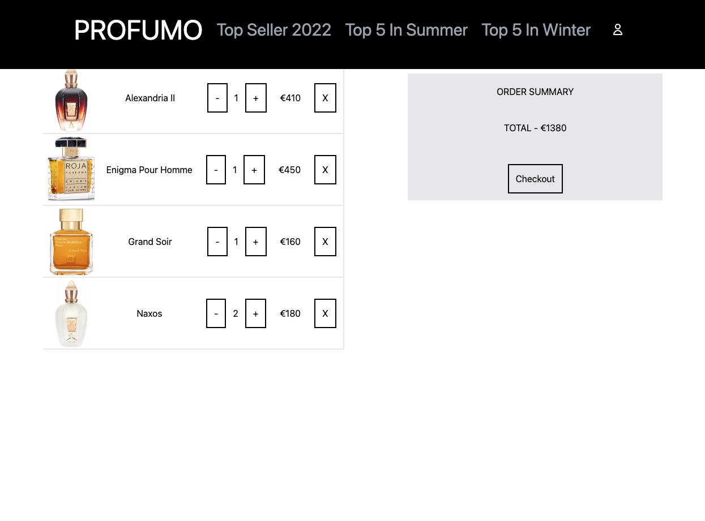

# How to start
```
npm start
```

## Website overview
### Landing Page
* User can move to other page clicking image of landing page or clicking top var options


### Add item to cart
* When the user clicks "Add to Cart" button, the cart will be appear from top left corner and a few seconds later, it will disappear 


### Flipping Card
* When the user clicks "Detail" button, card starts to flip and user can see the detail of that cologne


### My Cart
* User can confirm items which added in to cart



### User Page
* User can login or sign up from this page


### Wish List
* After login, User can check colognes they liked


### Orders
* User can review their previous order confirmation


